# PRÁCTICA 1

## 1. Identificación de interfaces de red

En cada máquina, muestra las interfaces de red disponibles ejecutando:
ip a
Responde:
• ¿Qué interfaz de red está activa?
Estan activas ambas UP y LOWER_UP son los indicativos de ello
• ¿Qué dirección IP tiene asignada actualmente?
192.168.50.10/24
• ¿Qué dirección MAC tiene la interfaz?
08:00:27:e2:37:43
• ¿A qué red pertenece la dirección IP?
La IP pertenece a 192.168.50.0/24
Incluye capturas del comando ejecutado y explica la información que aparece en la salida

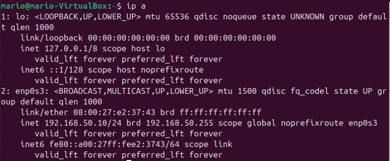

Hemos usado el comando ip a para ver todas las direcciones IP e interfaces de red en nuestra
máquina virtual de ubuntu desktop

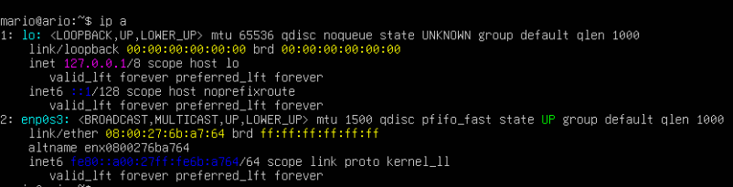

lo mismo que en el paso anterior pero en ubuntu server

Indica también qué documentación has consultado para entender el funcionamiento del comando
ip.

https://ubuntu.com/server/docs/explanation/networking/configuring-networks/

## 2. Identificación de la configuración de red

Muestra nuevamente la configuración IP:
ip addr

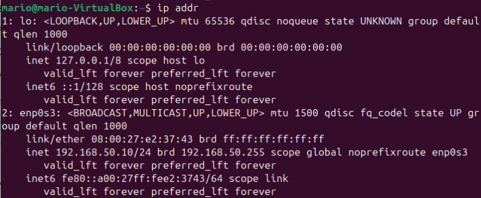

Vemos básicamente la misma información que veiamos al usar ip a

Muestra la tabla de rutas del sistema:
ip route

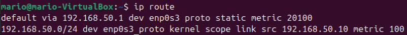

Aqui podemos ver de manera muy esquematizada la información de ip address y las
puertas de enlace
Responde:
• ¿Qué red local aparece configurada?
• ¿Qué interfaz se utiliza para acceder a esa red?
La interfaz activa es enp0s3
• ¿Existe una puerta de enlace configurada?
Si, en este caso la puerta de enlace es 192.168.50.1
Incluye capturas y explica cada campo relevante que aparece en la información mostrada.

Indica las fuentes utilizadas para comprender la información mostrada por estos comandos.

https://ubuntu.com/server/docs/explanation/networking/configuring-networks/

## 3. Configuración del nombre de host

Consulta el nombre actual del sistema ejecutando:
hostname
Configura el nombre correspondiente.
Servidor:
sudo hostnamectl set-hostname srv01
Cliente:
sudo hostnamectl set-hostname cli01
Comprueba el cambio ejecutando:
hostname
Incluye capturas antes y después del cambio y explica qué función tiene el hostname dentro de una
red.

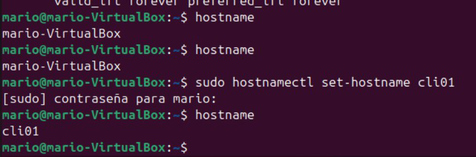

Estoy usando el comando sudo hostnamectl para cambiar el hostname del sistema al indicado para
la practica

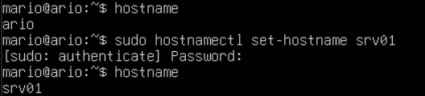

lo mismo que en la imagen anterior pero en ubuntu server
Indica la documentación consultada para comprender el uso del comando hostnamectl.

https://manpages.ubuntu.com/manpages/focal/man1/hostnamectl.1.html

## 4. Configuración de dirección IP estática

Edita el archivo de configuración de red:
sudo nano /etc/netplan/01-netcfg.yaml
Configura las direcciones IP según el esquema definido en el escenario.

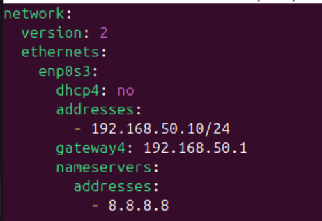

Aquí estamos escribiendo el netplan con los parámetros correctos para la práctica

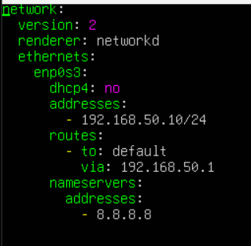

Exactamente lo mismo pero en ubuntu server

Aplica la configuración:
sudo netplan apply
Comprueba la configuración:
ip a
Incluye capturas del archivo de configuración y del resultado del comando utilizado para comprobar
la configuración.

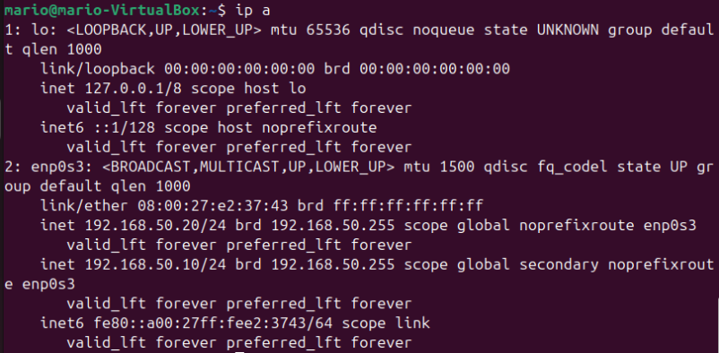

Volvermos a poner el comando ip a para comprobar que el netplan ha funcionado y ha cambiado la
ip

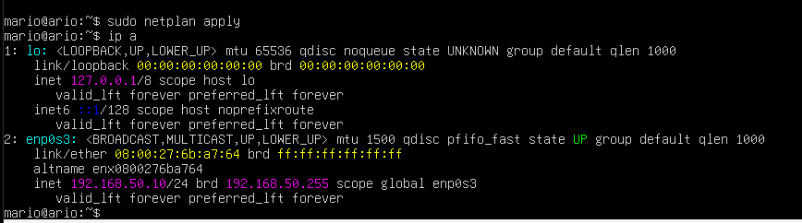

Con sudo netplan apply lo que hacemos es aplicar los cambios que hemos puesto en el netplan

Explica qué función cumple cada parámetro utilizado en el archivo de configuración.
• Network Es el bloque principal que define toda la configuración de red del sistema
• version: 2 Indica la versión del formato netplan utilizado
• ethernets Define la interfaz de las redes
• enp0s3 Este es el nombre de la interfaz de red física
• dhcp4: no Desactiva la asignación automática de IP
• addresses Define la dirección IP asignada manualmente
• routes Define las rutas de red
• addresses DNS 8.8.8.8 es el servidor DNS público de google

Indica la documentación consultada sobre Netplan.

https://www.ochobitshacenunbyte.com/2021/04/26/netplan-configurar-la-red-en-ubuntu-20-04/

## 5. Verificación de conectividad entre máquinas

Desde el cliente ejecuta:
ping 192.168.50.10
Desde el servidor ejecuta:
ping 192.168.50.20

Responde:
• ¿Se reciben respuestas del otro equipo?
Si, las lineas que comienzan por 64 bytes son ejemplo de ello
• ¿Cuántos paquetes se envían y reciben?
Se envían de paquetes de manera indefinida hasta que uno mismo lo pare de manera manual.
• ¿Qué información muestra el comando ping?
Comprueba las repuestas del host, la dirección IP, el tamaño del paquete y el tiempo y
número de secuencia.

Incluye capturas y explica el significado de los valores que aparecen en la salida del comando.

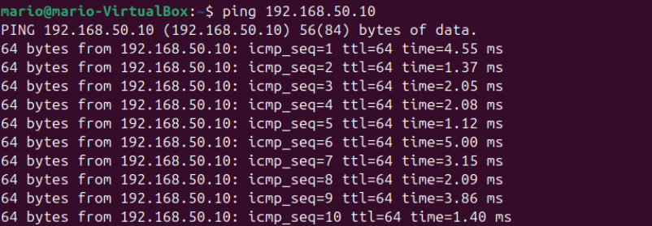

Vemos una lista con todos los paquetes que se han ido enviando desde que ejecutamos el comando
ping

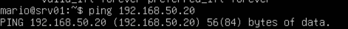

mismo caso que en la imagen anterior

Indica las fuentes consultadas para comprender el funcionamiento de ping.

https://somebooks.es/uso-del-comando-ping-ubuntu/

## 6. Configuración de resolución de nombres local

Edita el archivo:
sudo nano /etc/hosts
Añade las entradas:
192.168.50.10 srv01
192.168.50.20 cli01

Comprueba la resolución de nombres:
ping srv01
ping cli01

Incluye capturas y explica cómo funciona la resolución de nombres utilizando el archivo
/etc/hosts.

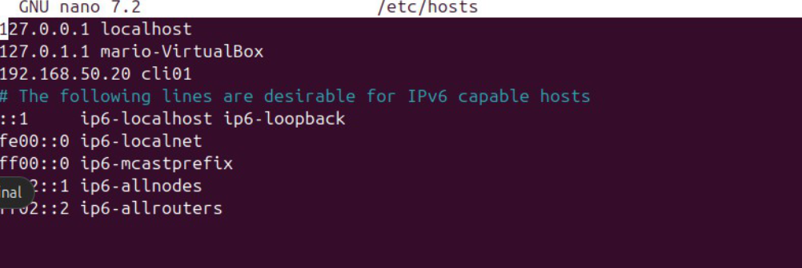

Con el comando sudo nano /etc/hosts podemos asociar el nombre de un host a una dirección IP

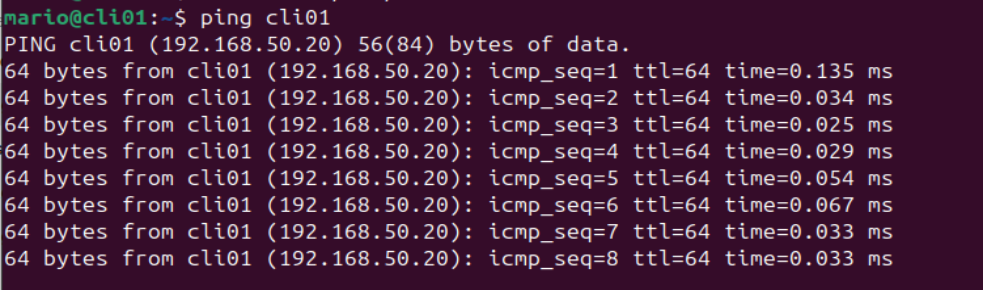

En esta imagen comprobamos que funciona ya que el resultado es el mismo a cuando metiamos la
IP

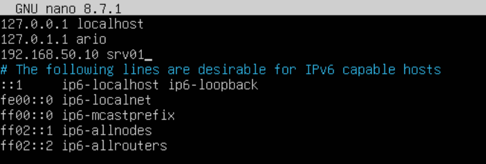

Lo editamos también para la asociación

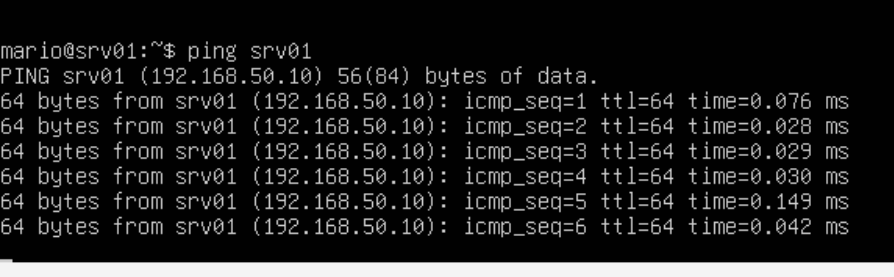

Y también funciona igual.

Indica la documentación consultada

## 7. Análisis de rutas de red
Muestra la tabla de rutas del sistema:
ip route

Responde:
• ¿Qué red aparece en la tabla de rutas?
• ¿Qué interfaz se utiliza para acceder a esa red?
• ¿Qué significa cada columna mostrada en la tabla?
Incluye capturas y explica la información mostrada.

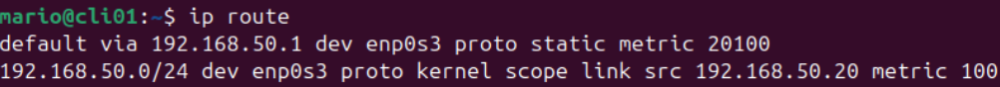

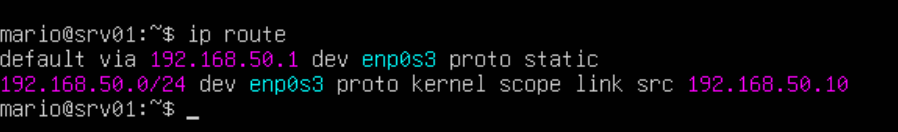

Indica las fuentes consultadas.

https://somebooks.es/uso-del-comando-ping-ubuntu/

## 8. Identificación de puertos y servicios activos
Muestra los puertos abiertos en el sistema:
ss -tuln

Responde:
• ¿Qué puertos aparecen abiertos?
Podemos ver varios como 0.0.0.0:22, 53 DNS (si estuviera instalado)
80 HTTP (si hay servidor web) 443 HTTPS
• ¿Qué significa cada columna mostrada en la salida del comando?
Netid indica si es fiable o esta desconectada.
State indica el estado del socket.
Recv-q y send-q tanto los datos recibidos como enviados que están en la cola.
Local Address:Port IP y puerto del servicio en la máquina local.
Peer Address:Port Desde dónde puede conectarse.
• ¿Qué protocolos se están utilizando?
TCP

Incluye capturas y explica la información obtenida.

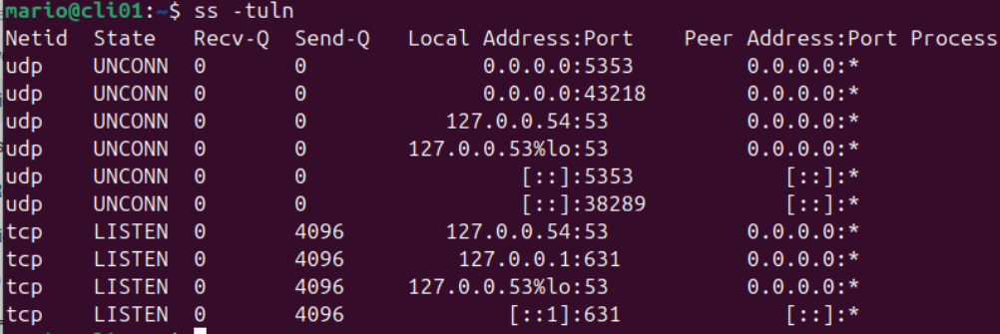

Con el comando ss -tuln podemos ver toda la información de los sockets de la máquina virtual y sus
estadísticas.

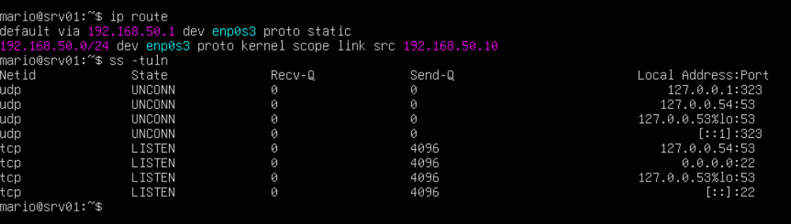

Lo mismo que antes aplicado a ubuntu serever.

Indica la documentación consultada sobre el comando ss.
https://juncotic.com/ss-usas-netstat-es-hora-de-actualizarse/

## 9. Instalación y configuración del servicio SSH
En el servidor ejecuta:
sudo apt update
sudo apt install openssh-server

Comprueba el estado del servicio:
sudo systemctl status ssh

Comprueba que el puerto está abierto:
ss -tuln

Incluye capturas y explica qué servicio se ha instalado y qué función cumple dentro de una red.

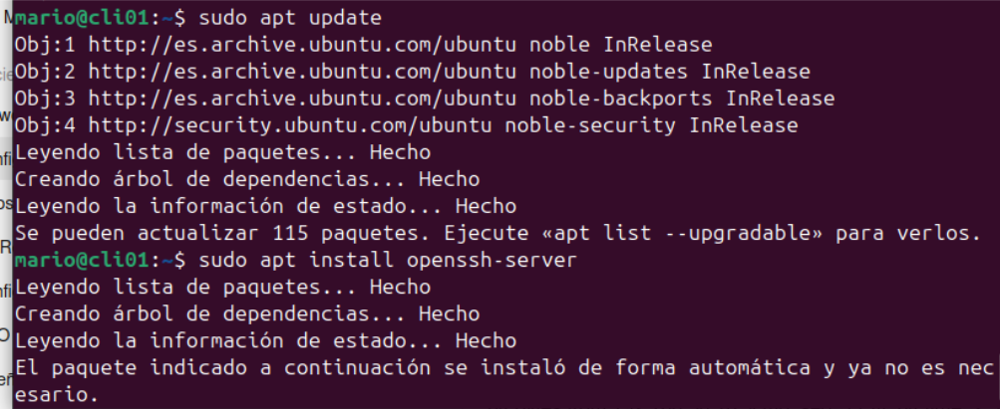

Actualizamos todo e instalamos el paquete ssh

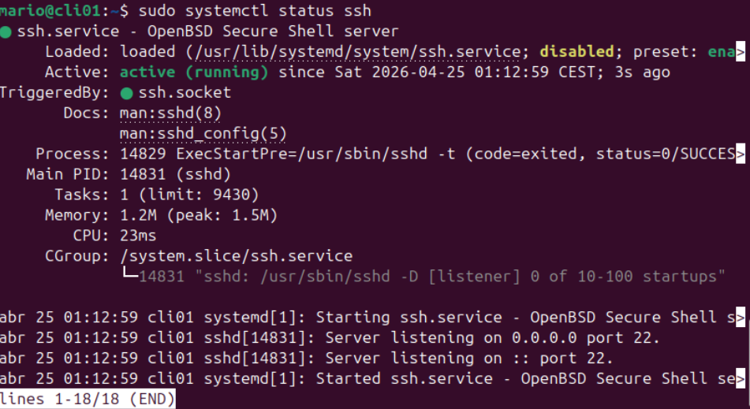

Con el comando systemctl status comprobamos que se ha instalado correctamente y además se
encuentra en funcionamiento eso lo sabes gracias a Active: active (running)

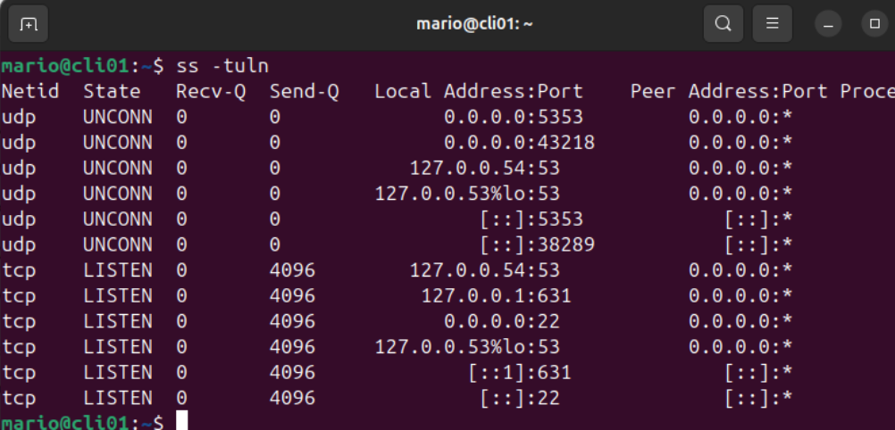

Aquí comprobamos que en efecto esta fincionando correctamente

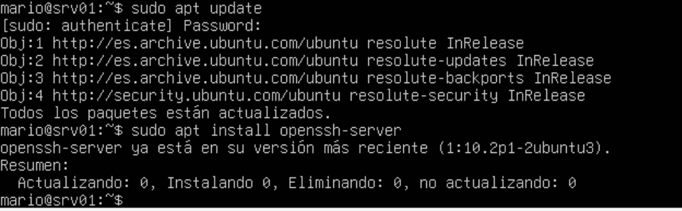

En este caso me dice que openssh ya se encuentra actualizado

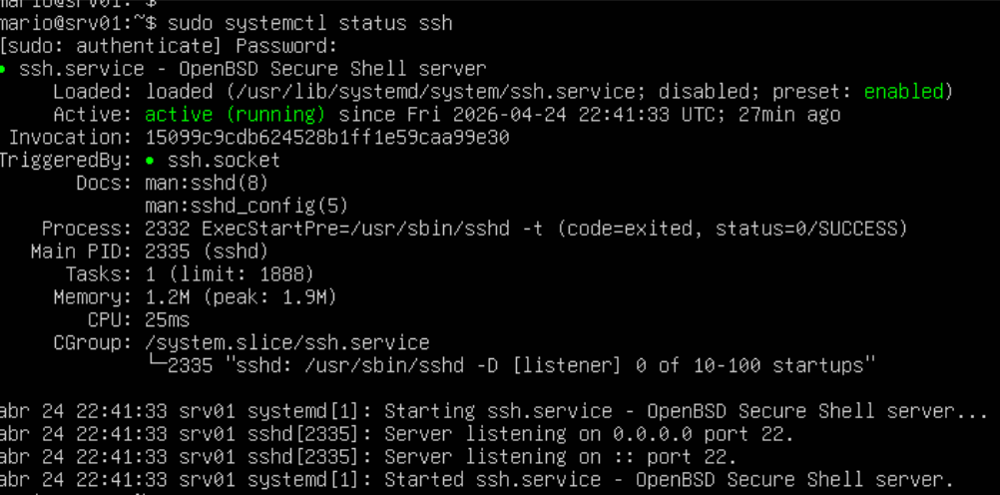

Y exactamente lo mismo que antes, active(running)

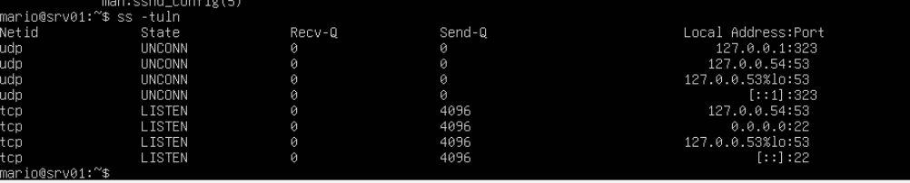

Indica la documentación consultada.
https://www.digitalocean.com/community/tutorials/how-to-use-systemctl-to-manage-systemd-
services-and-units

## 10. Acceso remoto al servidor
Desde cli01, establece una conexión SSH con el servidor:
ssh usuario@192.168.50.10

Una vez conectado ejecuta:
whoami
hostname

Incluye capturas de la conexión remota y explica:
• qué usuario está conectado
Esta conectado el usuario mario
• en qué máquina se están ejecutando los comandos
Antes de la conexión SSH: los comandos se ejecutan en cli01 (cliente)
Después de la conexión SSH: los comandos se ejecutan en el servidor srv01 de forma
remota

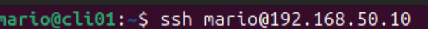

Usamos el comando para empezar la conexión ssh

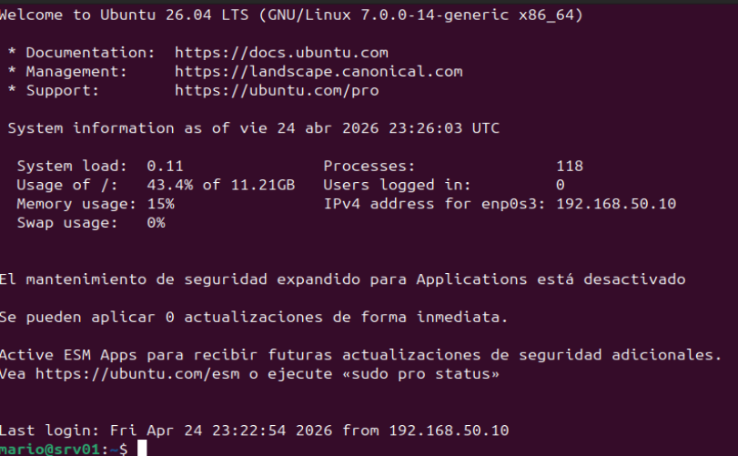

Vemos que ha funcionado ya que al lado de mario el nombre del host ha cambiado de cli01 a srv01

Indica la documentación consultada sobre SSH.
https://ubuntu.com/server/docs/how-to/security/openssh-server/

## 11. Análisis del estado de las interfaces
Muestra el estado de las interfaces ejecutando:
ip link

Responde:
• ¿Qué interfaces aparecen en el sistema?
Aparecen lo y enp0s3
• ¿Qué estado tiene cada una (UP, DOWN)?
Ambas están en un estado UP

Incluye capturas y explica la información mostrada.

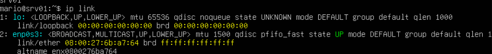

sirve para visualizar y gestionar las interfaces de red de bajo nivel, permitiendo activar/desactivar
interfaces, cambiar direcciones MAC

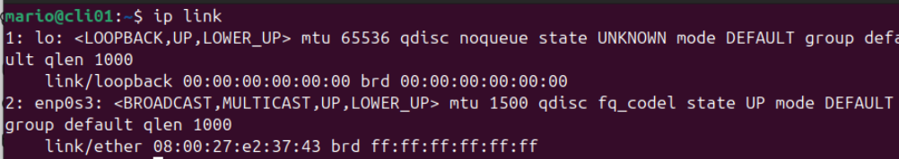

Es practicamente lo mismo aplicado para ubuntu desktop

Indica la documentación consultada.
https://www.ibiblio.org/pub/Linux/docs/LuCaS/Presentaciones/200103hispalinux/eric/html/interfac
es.html

## 12. Consulta de la tabla ARP
Muestra las entradas de la tabla ARP ejecutando:
ip neigh
Responde:
• ¿Qué dirección IP aparece asociada a la otra máquina?
En srv01 → 192.168.50.20
En cli01 → 192.168.50.10
Es la IP del otro equipo en la red.
• ¿Qué dirección MAC tiene?
Es la que aparece después de lladdr

Incluye capturas y explica la relación entre direcciones IP y direcciones MAC.

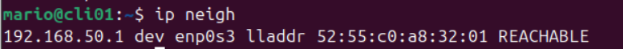

Con ip neigh vemos as asociaciones entre direcciones IP y direcciones físicas (MAC) de
dispositivos conectados a la misma red local,

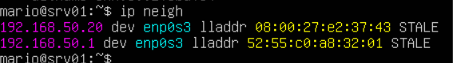

Hacemos lo mismo para ubuntu server

Indica la documentación consultada.

https://manpages.ubuntu.com/manpages/jammy/man8/ip-neighbour.8.html

## 13. Transferencia de archivos entre máquinas
Desde el cliente crea un archivo:
nano prueba.txt
Copia el archivo al servidor utilizando:
scp prueba.txt usuario@192.168.50.10:/home/usuario
Comprueba en el servidor que el archivo se ha copiado correctamente.

Incluye capturas del proceso y explica cómo funciona la transferencia de archivos mediante scp.

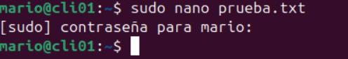

Creamos el archivo prueba.txt

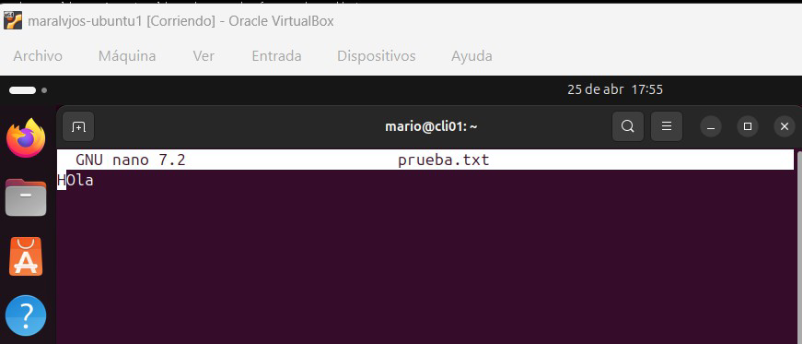

escribimos algo dentro del archivo de texto

Indica la documentación consultada.

## 14. Gestión del servicio SSH
En el servidor ejecuta:
sudo systemctl stop ssh
Comprueba si el puerto sigue abierto:
ss -tuln
Intenta conectarte desde el cliente.
Después vuelve a iniciar el servicio:
sudo systemctl start ssh

Incluye capturas de las pruebas realizadas y explica qué ocurre cuando el servicio está detenido y
cuando vuelve a iniciarse.

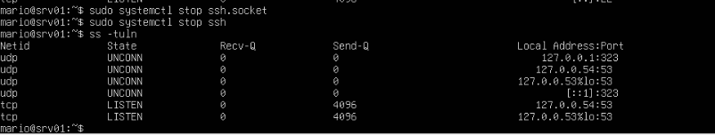

Usamos el comando para pararlo y vemos como el puerto acabado en :22 ya no está

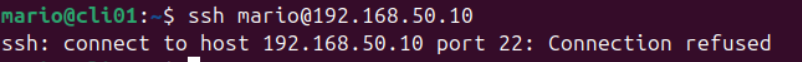

Ahora vemos que desde la otra máquina la conexión es rechazada

Indica la documentación consultada.

https://www.digitalocean.com/community/tutorials/how-to-use-systemctl-to-manage-systemd-
services-and-units

## INDEX

[Indice](../index.md)

